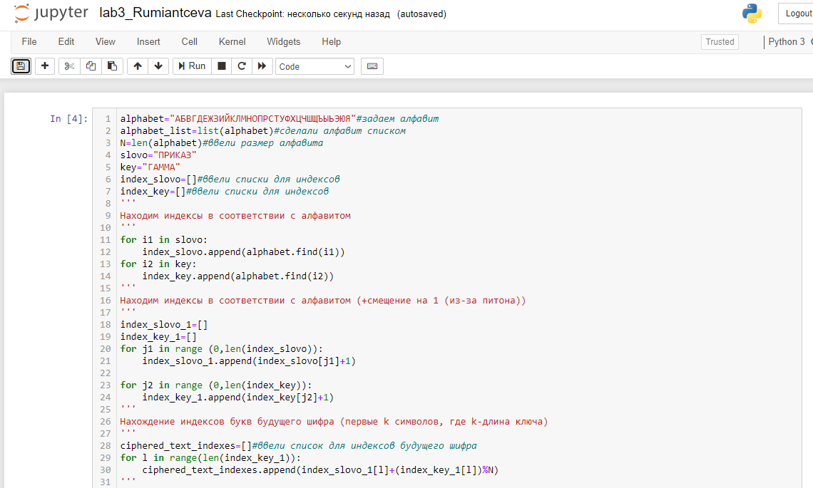
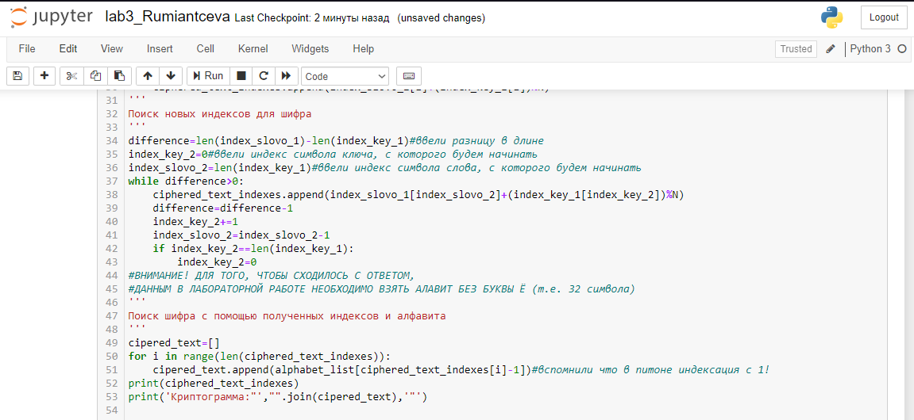
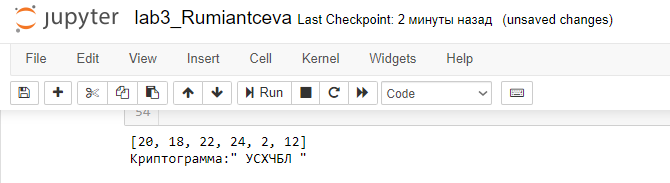

---
## Front matter
lang: ru-RU
title: |
    Отчёт по лабораторной работе №3.  
    Шифрование гаммированием
author: |
    *Дисциплина: Математические основы защиты информации*  
    *и информационной безопасности*  
    \vspace{2pt}
    **Студент:** Румянцева Александра Сергеевна 1132223493  
		**Группа:** НПМмд-02-22  
		**Преподаватель:** д-р.ф.-м.н., проф. Кулябов Дмитрий Сергеевич
    \vspace{2pt}
date: 14 ноября, 2022, Москва

## Formatting
toc: false
slide_level: 2
theme: metropolis
header-includes:
 - \metroset{progressbar=frametitle,sectionpage=progressbar,numbering=fraction}
 - '\makeatletter'
 - '\beamer@ignorenonframefalse'
 - '\makeatother'
aspectratio: 43
section-titles: true
linestretch: 1.25

mainfont: PT Serif
romanfont: PT Serif
sansfont: PT Sans
monofont: PT Mono
mainfontoptions: Ligatures=TeX
romanfontoptions: Ligatures=TeX
sansfontoptions: Ligatures=TeX,Scale=MatchLowercase
monofontoptions: Scale=MatchLowercase,Scale=0.7
---

## Цели и задание на лабораторную работу

Целью данной лабораторной работы является ознакомление с шифрованием гаммированием, а так же реализация шифра на произвольном языке программирования.

Задание: Реализовать алгоритм шифрования гаммированием конечной гаммой.

---

## Выполнение лабораторной работы

1. Изучила теорию и указание к лабораторной работе.

---

## Гаммирование. Реализация

2. Реализация кода для гаммирования конечной гаммой.

{ #fig:001 width=70% }

---

## Гаммирование. Реализация

{ #fig:002 width=70% }

---	

## Гаммирование. Результаты

{ #fig:003 width=70% }

---

## Выводы

Таким образом, была достигнута цель, поставленная в начале лабораторной работы: я ознакомилась с шифрованием гаммированием, а так же реализовала шифр на языке программирования Python.
